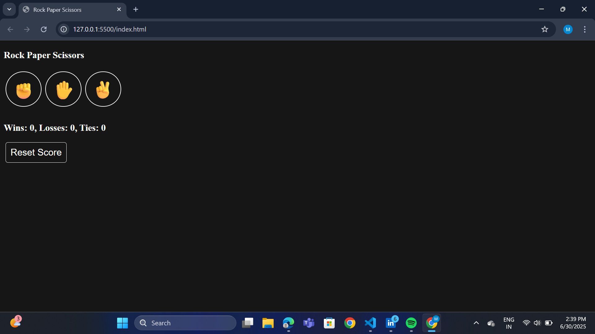
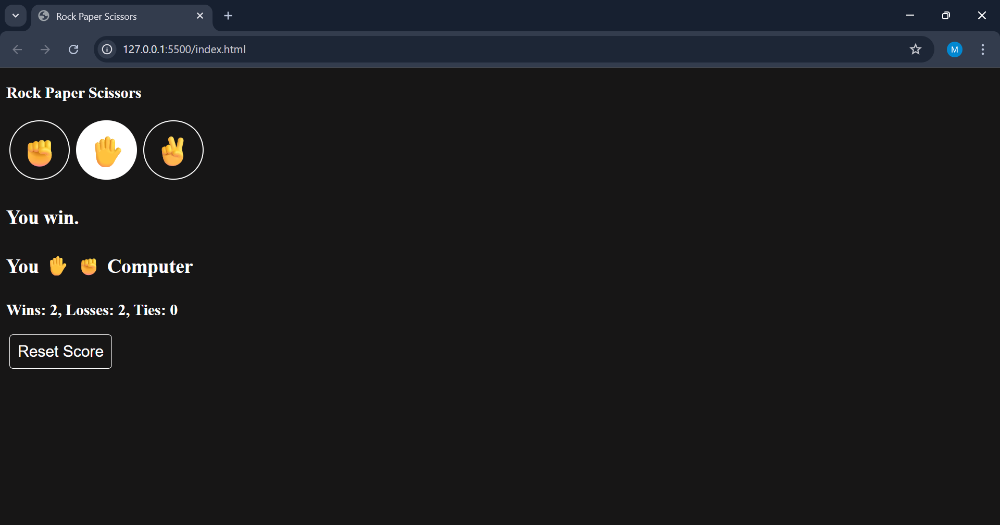

# ✊✋✌️ Rock Paper Scissors Game

A clean and responsive emoji-based Rock Paper Scissors game built with HTML, CSS, and JavaScript.

## 🔍 Features
- Emoji buttons for interaction
- Score tracking and result display
- Responsive layout
- Reset functionality

### 🕹️ Game Rules

- ✊ **Rock** beats ✌️ **Scissors**
- ✋ **Paper** beats ✊ **Rock**
- ✌️ **Scissors** beats ✋ **Paper**

### 🔁 Game Flow
1. Player selects one of the three moves (✊, ✋, ✌️)
2. Computer randomly picks one too
3. Outcome is decided:
   - Win
   - Lose
   - Tie
4. Scores update live in the interface

## 🖼️ Screenshots

## 🔗 Live Demo
[Play the Rock-Paper-Scissors Game](https://balubalaji04.github.io/Mini-Game-Project/)

